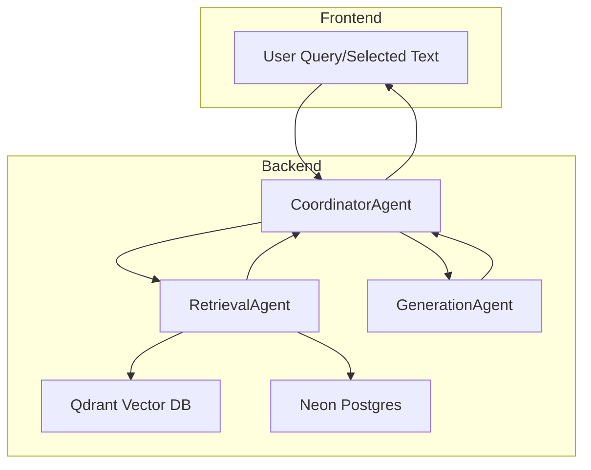
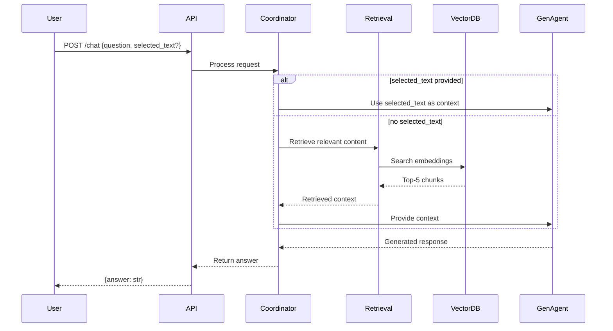

# Research: Book-Integrated RAG Chatbot Architecture

## Overview
This research document details the architecture plan for the Book-Integrated RAG Chatbot based on the user requirements and constitutional principles.

## 1. Data Flow Architecture

### Decision: Multi-Stage Processing Pipeline
The system will implement a multi-stage processing pipeline for book content:
Book text → Chunking (RecursiveCharacterTextSplitter) → Embeddings (OpenAI API) → Storage in Qdrant and Neon Postgres

### Rationale:
- Ensures scalable processing of large books
- Separates content processing from query handling
- Enables parallel processing with Ray for large books
- Maintains constitutional requirement for accuracy (grounded responses)

### Implementation:
- Use LangChain's RecursiveCharacterTextSplitter for consistent chunking
- Apply 500-1000 character segments with 200 character overlap
- Generate embeddings using OpenAI 'text-embedding-ada-002'
- Store vectors in Qdrant collection 'book_content' with Cosine distance and size 1536
- Store metadata (ID, page, section) in Neon Postgres

## 2. Multi-Agent Architecture

### Decision: Three-Agent System
The system will implement three specialized agents:
- RetrievalAgent: Queries Qdrant and Neon Postgres for relevant content
- GenerationAgent: Prompts GPT with retrieved context to generate responses
- CoordinatorAgent: Handles API requests, manages selected text processing

### Rationale:
- Enables proper separation of concerns
- Supports constitutional requirement for multi-agent architecture
- Facilitates scalability and maintainability
- Allows for specialized optimization of each component

### Implementation:
- Use OpenAI Agents SDK for agent creation and management
- Implement MCP for agent messaging
- Use A2A patterns for async workflows
- Each agent will have specific responsibilities and interfaces

## 3. Backend Architecture

### Decision: FastAPI with Async Endpoints
The backend will use FastAPI with async endpoints integrated with QdrantClient, psycopg2, and OpenAI client.

### Rationale:
- FastAPI provides excellent async support for high-performance APIs
- Built-in OpenAPI documentation generation
- Easy integration with the required dependencies
- Supports constitutional performance requirements

### Implementation:
- Create async /chat endpoint accepting JSON {question: str, selected_text: optional str}
- Return JSON {answer: str} responses
- Implement proper error handling and validation
- Include rate limiting middleware
- Add request/response logging

## 4. Frontend Architecture

### Decision: Dual Frontend Approach
The system will include:
- Chainlit UI for testing and development
- JavaScript snippet for book viewer embedding

### Rationale:
- Chainlit provides easy testing interface for development
- JavaScript snippet enables seamless integration with web-based book platforms
- Supports constitutional requirement for user experience focus
- Enables text selection functionality

### Implementation:
- Simple Chainlit chat UI with session management
- JavaScript event listener: document.addEventListener('mouseup', () => { ... })
- Use window.getSelection().toString() for text selection
- Send selected text to /chat API with appropriate context

## 5. Deployment Architecture

### Decision: Hybrid Deployment Stack
The system will use:
- Docker Compose for local development
- Kubernetes with Dapr for production (actors for session state)
- Ray clusters for batch processing

### Rationale:
- Docker Compose provides consistent local development environment
- Kubernetes with Dapr supports constitutional scalability requirements
- Ray clusters enable efficient processing of large books
- Production-ready deployment architecture

### Implementation:
- Dockerfiles for each service (backend, frontend)
- Kubernetes manifests for production deployment
- Dapr components for state management and pub/sub
- Ray cluster configuration for parallel processing

## 6. Integration Points

### Decision: Standardized Communication Protocols
The system will use:
- MCP for agent messaging
- A2A (Actor-to-Actor) for async workflows
- RESTful APIs for frontend-backend communication

### Rationale:
- MCP enables efficient inter-agent communication
- A2A patterns support scalable async operations
- RESTful APIs provide standard web integration
- Aligns with constitutional requirements for scalability

## 7. Milestone Planning

### Decision: Incremental Development Approach
Development will follow 6 key milestones:
1. Content ingestion script
2. Retrieval module
3. Generation module
4. API server
5. UI embedding
6. Tests and evaluations

### Rationale:
- Enables iterative development and testing
- Allows for early validation of core components
- Supports constitutional requirement for testing excellence
- Provides clear progress indicators

## 8. Architecture Diagrams (Mermaid)

### Agent Interactions

### Data Flow

## 9. Technology Stack Alignment

### Decision: Constitutional Compliance
All technology choices align with constitutional requirements:
- Accuracy-First Design: Responses restricted to book content
- Scalability Architecture: Qdrant Cloud + Ray processing
- Security-First Integration: API keys + rate limiting
- Performance Optimization: <2s response time target

### Implementation:
- Strict adherence to constitutional principles
- Regular compliance checks during development
- Proper error handling for edge cases
- Comprehensive testing at all levels

## Conclusion
The research confirms that the proposed architecture aligns with all requirements:
- Multi-agent system with proper separation of concerns
- Scalable data processing and storage architecture
- Secure and performant API design
- User-focused frontend integration
- Production-ready deployment approach