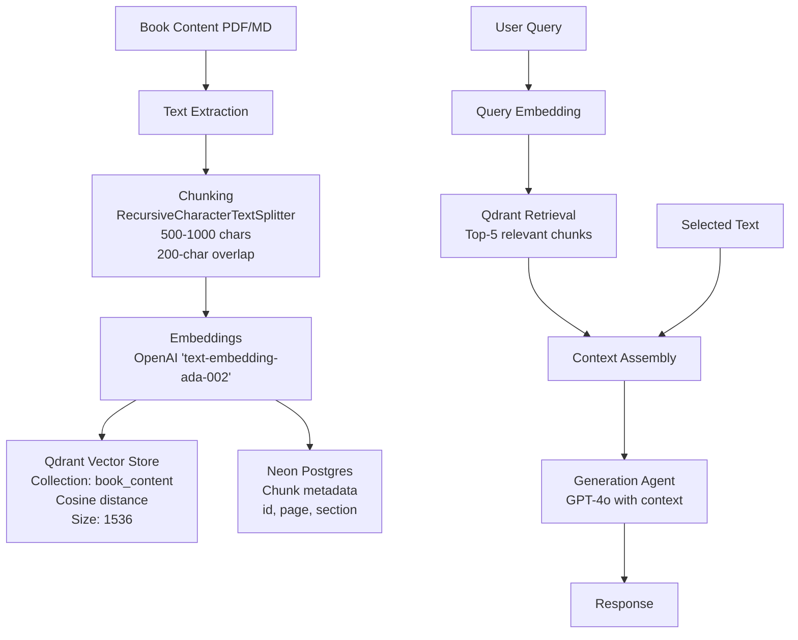

# Implementation Plan: Book-Embedded RAG Chatbot

**Branch**: `004-book-rag-chatbot` | **Date**: 2025-12-25 | **Spec**: [specs/004-book-rag-chatbot/spec.md](specs/004-book-rag-chatbot/spec.md)
**Input**: Feature specification from `/specs/[###-feature-name]/spec.md`

**Note**: This template is filled in by the `/sp.plan` command. See `.specify/templates/commands/plan.md` for the execution workflow.

## Summary

Implementation of a Book-Embedded RAG Chatbot that enables readers to query book content through a conversational interface. The system will process book content (PDF/Markdown), chunk and embed it, store in Qdrant vector database and Neon Postgres metadata store, and provide a multi-agent architecture (RetrievalAgent, GenerationAgent, CoordinatorAgent) to handle user queries with proper context grounding. The solution includes a FastAPI backend, embeddable frontend widget, and production-ready deployment with Kubernetes and Dapr.

## Technical Context

<!--
  ACTION REQUIRED: Replace the content in this section with the technical details
  for the project. The structure here is presented in advisory capacity to guide
  the iteration process.
-->

**Language/Version**: Python 3.11+
**Primary Dependencies**: FastAPI, OpenAI SDK, Qdrant Client, psycopg2, Ray, Dapr
**Storage**: Qdrant Cloud (vector store), Neon Postgres (metadata)
**Testing**: pytest, integration tests for RAG pipeline
**Target Platform**: Linux server (containerized), Web browsers (frontend widget)
**Project Type**: web - backend API with embeddable frontend widget
**Performance Goals**: <2s response time for 95% of queries, handle large books (>500 pages)
**Constraints**: <2s p95 response time, rate limiting to prevent abuse, token-efficient processing
**Scale/Scope**: Support concurrent users, large books with 100k+ chunks, distributed processing

## Constitution Check

*GATE: Must pass before Phase 0 research. Re-check after Phase 1 design.*

### Compliance Verification

1. **Accuracy-First Design**:
   - [x] Responses will be restricted to book content or user-selected text only
   - [x] All responses will be grounded in provided source material with proper citation
   - [x] Hallucinations will be avoided through strict context limitations

2. **Scalability Architecture**:
   - [x] Using Qdrant Cloud for vector storage with Ray for distributed embedding processing
   - [x] Designed to handle growing content and user load
   - [x] Architecture handles large books (>500 pages) without performance degradation

3. **Security-First Integration**:
   - [x] API keys for OpenAI, Neon Postgres, and Qdrant
   - [x] FastAPI with rate limiting implementation
   - [x] Proper authentication and authorization measures

4. **User Experience Focus**:
   - [x] Support for both full-book and selected-text query modes
   - [x] Intuitive interfaces that integrate seamlessly into book viewing platforms
   - [x] Minimal disruption to the reading experience

5. **Performance Optimization**:
   - [x] <2s response time target for 95% of requests
   - [x] Efficient handling of concurrent users
   - [x] Consistent performance across different query types

6. **Spec-Driven Development**:
   - [x] Features derive from explicit specifications with measurable outcomes
   - [x] Clear requirements with testable acceptance criteria
   - [x] Defined success metrics

7. **Token-Efficient Architecture**:
   - [x] Following constitutional requirement for token-efficient processing
   - [x] Heavy logic will execute in scripts, not in LLM context
   - [x] Only skill instructions and final outputs will enter context

8. **Reproducibility**:
   - [x] All implementations deterministic and version-controlled
   - [x] Dependencies and configurations explicitly defined
   - [x] Proper documentation for consistent reproduction

### Potential Violations and Justifications

- [ ] List any potential constitutional violations and justifications here

### Post-Design Constitution Re-check

After implementing the detailed design:

1. **Accuracy-First Design**:
   - [ ] API enforces responses are grounded in book content only
   - [ ] Response model includes proper citation information
   - [ ] Context limitations are strictly enforced

2. **Scalability Architecture**:
   - [ ] Vector store supports required scale
   - [ ] API supports concurrent user handling
   - [ ] Rate limiting prevents resource exhaustion

3. **Security-First Integration**:
   - [ ] API endpoints follow security best practices
   - [ ] Rate limiting implemented to prevent abuse
   - [ ] Sensitive data properly handled in models

4. **User Experience Focus**:
   - [ ] API supports both full-book and selected-text queries
   - [ ] Rich response model with citations and context
   - [ ] Intuitive interfaces for seamless integration

5. **Performance Optimization**:
   - [ ] Response times measured and reported in API
   - [ ] Chunked content enables efficient retrieval
   - [ ] Health check endpoint monitors service performance

6. **Spec-Driven Development**:
   - [ ] API contract defines clear interfaces
   - [ ] Response models include testable metrics
   - [ ] Error handling patterns are standardized

7. **Token-Efficient Architecture**:
   - [ ] API minimizes response sizes with efficient data models
   - [ ] Only necessary context is passed between components
   - [ ] Heavy processing happens in dedicated services, not in API layer

8. **Reproducibility**:
   - [ ] API documented with OpenAPI format
   - [ ] Data models fully specified with validation rules
   - [ ] Implementation follows constitutional requirements

## Project Structure

### Documentation (this feature)

```text
specs/004-book-rag-chatbot/
├── plan.md              # This file (/sp.plan command output)
├── research.md          # Phase 0 output (/sp.plan command)
├── data-model.md        # Phase 1 output (/sp.plan command)
├── quickstart.md        # Phase 1 output (/sp.plan command)
├── contracts/           # Phase 1 output (/sp.plan command)
└── tasks.md             # Phase 2 output (/sp.tasks command - NOT created by /sp.plan)
```

### Source Code (repository root)

```text
backend/
├── src/
│   ├── models/
│   │   ├── chunk.py
│   │   ├── query_log.py
│   │   └── book_metadata.py
│   ├── services/
│   │   ├── ingestion_service.py
│   │   ├── retrieval_service.py
│   │   ├── generation_service.py
│   │   └── coordinator_service.py
│   ├── api/
│   │   ├── endpoints/
│   │   │   ├── chat.py
│   │   │   ├── ingest.py
│   │   │   └── query.py
│   │   └── middleware.py
│   ├── agents/
│   │   ├── retrieval_agent.py
│   │   ├── generation_agent.py
│   │   └── coordinator_agent.py
│   ├── config/
│   │   ├── settings.py
│   │   └── __init__.py
│   └── main.py
├── tests/
│   ├── unit/
│   ├── integration/
│   └── contract/
├── requirements.txt
├── Dockerfile
└── alembic/
    └── versions/

frontend/
├── src/
│   ├── components/
│   │   ├── ChatBot/
│   │   ├── EmbeddedChatBot/
│   │   └── FloatingChatButton/
│   ├── services/
│   └── utils/
├── public/
├── Dockerfile
└── package.json

shared/
├── docker-compose.yml
├── k8s/
│   ├── deployment.yaml
│   ├── service.yaml
│   └── configmap.yaml
└── dapr/
    ├── components/
    └── config.yaml
```

**Structure Decision**: Multi-service architecture with separate backend and frontend applications connected via API. Backend uses FastAPI with agents for RAG processing, while frontend provides embeddable components for book integration. Shared deployment configurations for local and production deployment.

## Complexity Tracking

> **Fill ONLY if Constitution Check has violations that must be justified**

| Violation | Why Needed | Simpler Alternative Rejected Because |
|-----------|------------|-------------------------------------|
| [e.g., 4th project] | [current need] | [why 3 projects insufficient] |
| [e.g., Repository pattern] | [specific problem] | [why direct DB access insufficient] |

## Phase 0: Research & Architecture

### 0.1 Data Flow Architecture


### 0.2 Agent Architecture
```mermaid
graph LR
    A[Coordinator Agent] --> B[Retrieval Agent]
    A --> C[Generation Agent]
    A --> D[API Request<br/>{question, selected_text}]
    B --> E[Qdrant Query]
    B --> F[Neon Postgres<br/>Metadata Query]
    C --> G[OpenAI API<br/>GPT-4o]
    E --> B
    F --> B
    B --> A
    G --> C
    C --> A
    A --> H[Response<br/>{answer}]
```

### 0.3 Technology Stack Justification

- **FastAPI**: High-performance async web framework with automatic OpenAPI documentation
- **Qdrant**: Efficient vector database with cosine similarity search for semantic retrieval
- **Neon Postgres**: Serverless PostgreSQL for structured metadata storage and query logging
- **OpenAI**: Proven embedding and generation models (text-embedding-ada-002, GPT-4o)
- **Ray**: Distributed computing framework for parallel embedding of large books
- **Dapr**: Sidecar architecture for state management and service discovery in Kubernetes
- **Chainlit**: Rapid prototyping of chat interfaces for testing

## Phase 1: Design & Contracts

### 1.1 Data Model Design

The system will implement three core entities:

1. **Book Chunk**: Represents a segment of book content with embedding vector and metadata
2. **Query Log**: Records user interactions for analytics and system improvement
3. **Book Metadata**: Contains book processing information and status

### 1.2 API Contract Design

The system will expose a REST API with the following endpoints:

- `POST /chat`: Main endpoint for user queries with optional selected text context
- `POST /ingest`: Endpoint for book content ingestion and processing
- `GET /health`: Health check endpoint for monitoring

### 1.3 Deployment Architecture

The system will support multiple deployment modes:

- **Local**: Docker Compose with all services in containers
- **Production**: Kubernetes with Dapr sidecars for state management
- **Batch Processing**: Ray clusters for distributed book processing

## Milestones

1. **Content Ingestion Script**: Develop the book processing pipeline with chunking and embedding
2. **Retrieval Module**: Implement vector search and context assembly
3. **Generation Module**: Build the OpenAI integration for response generation
4. **API Server**: Create the FastAPI application with all endpoints
5. **UI Embedding**: Develop the frontend components for book integration
6. **Tests and Evaluations**: Implement comprehensive testing and evaluation framework